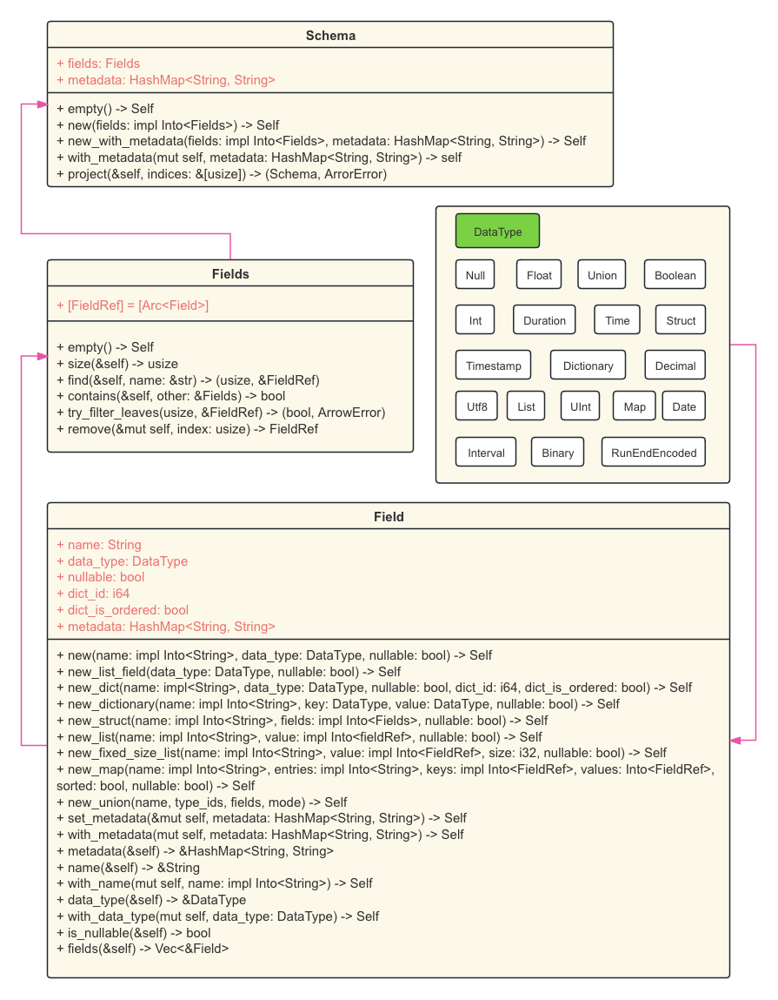
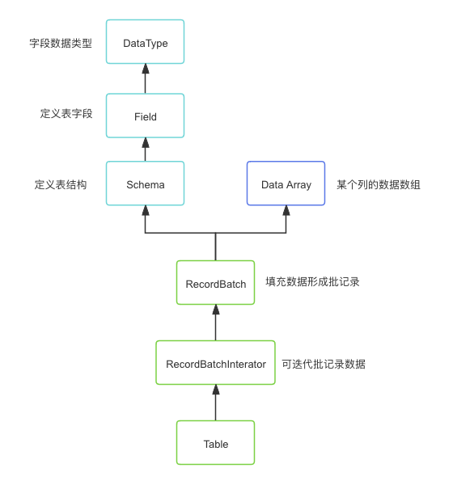
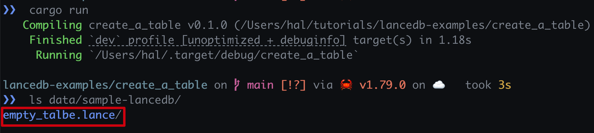
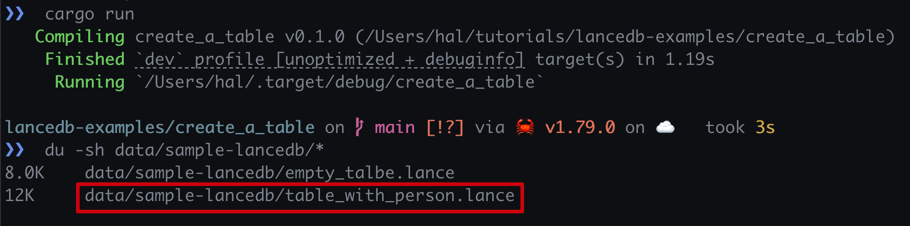
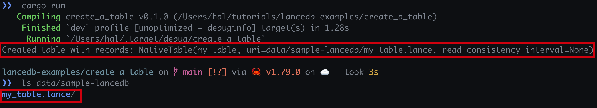
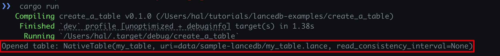
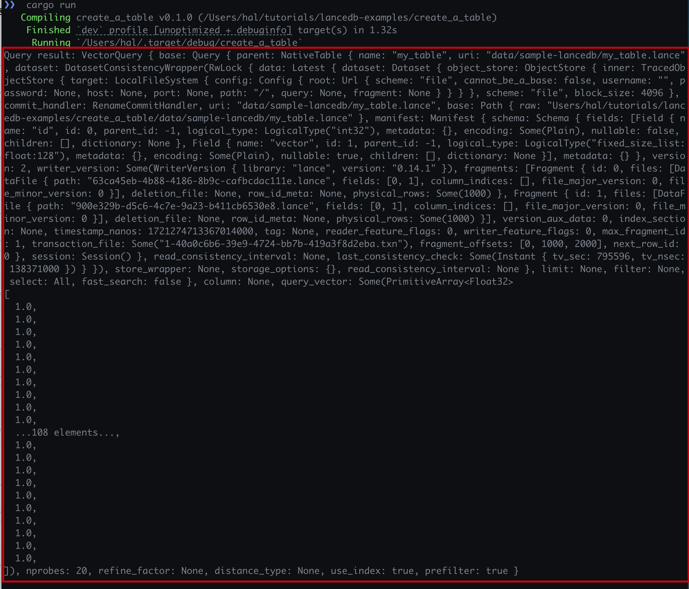

#  使用Rust进行LanceDB的创建、插入和查询数据以及删除操作

**LanceDB**是一种使用持久存储构建的用于矢量搜索的开源数据库，极大简化了检索、过滤和嵌入管理。
**LanceDB**的主要功能包括：
1. 生产规模的矢量搜索，无需管理服务器。
2. 存储、查询和过滤矢量、元数据和多模态数据（文本、图像、视频、点云等）。
3. 支持矢量相似性搜索、全文搜索和SQL。
4. 本地支持Python和Javascript/Typescript。
5. 零拷贝、自动版本管理，管理数据版本而无需额外基础设施。
6. GPU支持构建矢量索引（`*`）。
7. 生态系统集成

  - **LangChain**🦜️🔗
  - **LlamaIndex**🦙
  - **Apache-Arrow**
  - **Pandas**
  - **Polars**
  - **DuckDB**

## 关于LanceDB中`Table`介绍
### `Table`的**方法**
- `name()`: 获取表的名称
- `schema()`: 获取表的模式
- `count_rows()`: 获取表中的行数
- `add()`: 添加记录添加到表中，但传入的参数是需要实现`IntoArrow`的类型
- `query()`: 查询表中的记录
- `update()`: 更新表中的记录
- `delete()`: 删除表中的记录
- `create_index()`: 创建索引
- `merge_insert()`: 合并插入
- `vector_search()`: 矢量搜索
- `optimize()`: 优化表
- `add_columns()`: 添加(多)列
- `alter_columns()`: 修改(多)列
- `drop_columns()`: 删除(多)列
- `version()`: 获取表的版本，由于LanceDB使用版本控制变化
- `checkpoint()`: 根据指定版本获取检查点
- `checkpoint_latest()`: 获取最新检查点
- `restore()`: 恢复到指定版本
- `list_indices()`: 列出表的索引

## `Schema`模式定义`Table`定义方式




## 创建空表

1 完整代码
```rust
use arrow_schema::{DataType, Field, Schema};
use lancedb::{connect, Result};
use std::sync::Arc;

#[tokio::main]
async fn main() -> Result<()> {
  let created_empty_talbe = create_empty_table().await?;
  println!(
    "Created empty table: {}, Table name: {}",
    created_empty_talbe,
    created_empty_talbe.name()
  );
  Ok(())
}

#[allow(unused)]
async fn create_empty_table() -> Result<LanceDbTable> {
	// 创建模式定义
  let schema = Arc::new(Schema::new(vec![
    Field::new("id", DataType::Int32, false),
    Field::new("name", DataType::Utf8, false),
  ]));
	// 创建数据库URI目录
  let uri = "data/sample-lancedb";
	// 连接数据库
  let db = connect(uri).execute().await?;
	// 创建一个空表
  let table = db
    .create_empty_table("empty_talbe", schema)
    .execute()
    .await?;
  Ok(table)
}
```

2. 包依赖文件
`Cargo.toml`文件内容如下：
```toml
lancedb = "0.7.0"
tokio = {version = "1.38.0", features = ["rt-multi-thread"]}
arrow-schema = "51.0"
```

3. 运行结果如下:



## 创建带初始化数据的表

1. 完整代码如下:
```rust
use arrow_schema::{DataType, Field, Schema};
use arrow_array::{Int32Array, RecordBatch, RecordBatchIterator, StringArray};
use lancedb::{connect, Result, Table as LanceDbTable};
use std::sync::Arc;

#[tokio::main]
async fn main() -> Result<()> {
  let created_table_with_data = create_table_with_data().await?;
  println!(
    "Created table with data: {}, Table name: {}",
    created_table_with_data,
    created_table_with_data.name()
  );
  Ok(())
}

#[allow(unused)]
async fn create_table_with_data() -> Result<LanceDbTable> {
  // 创建本地数据库URI目录
  let uri = "data/sample-lancedb";
  // 连接数据库
  let db = connect(uri).execute().await?;

  // 创建模式定义
  let schema = Arc::new(Schema::new(vec![
    Field::new("id", DataType::Int32, false),
    Field::new("name", DataType::Utf8, false),
  ]));

  // 初始化`ids`列的数据
  let ids = Int32Array::from(vec![1, 2, 3]);
  // 初始化`name`列的数据
  let names = StringArray::from(vec!["Alice", "Bob", "Lily"]);
  // 使用`Schema`以及列数据创建`RecordBatch`
  let batch = RecordBatch::try_new(schema.clone(), vec![Arc::new(ids), Arc::new(names)])?;
  // 使用`RecordBatch`创建`RecordBatchIterator`
  let batchs = RecordBatchIterator::new(vec![batch].into_iter().map(Ok), schema);
  // 创建表，并插入初始化数据
  let table = db
    .create_table("table_with_person", batchs)
    .execute()
    .await?;
  Ok(table)
}
```
2. 包依赖文件
`Cargo.toml`文件内容如下：
```toml
lancedb = "0.7.0"
tokio = {version = "1.38.0", features = ["rt-multi-thread"]}
arrow-schema = "51.0"
```
3. 运行结果如下:


## 初始化记录并创建表

1. 完整代码
```rust
use arrow_array::types::Float32Type;
use arrow_array::{FixedSizeListArray, Int32Array, RecordBatch, RecordBatchIterator, StringArray};
use arrow_schema::{DataType, Field, Schema};
use lancedb::arrow::IntoArrow;
use lancedb::{connect, Result, Table as LanceDbTable};
use std::sync::Arc;

#[tokio::main]
async fn main() -> Result<()> {
  let created_table_with_records = create_table_with_records().await?;
  println!(
    "Created table with records: {}, Table name: {}",
    created_table_with_records,
    created_table_with_records.name()
  );
  Ok(())
}

#[allow(unused)]
async fn create_table_with_records() -> Result<LanceDbTable> {
  let uri = "data/sample-lancedb";
  let db = connect(uri).execute().await?;

  let initial_data = create_some_records()?;
  let tbl = db.create_table("my_table", initial_data).execute().await?;

  let new_data = create_some_records()?;
  // NOTICE: 只有实现了 IntoArrow 的类型才能使用`add`方法，即`create_some_records`返回的类型
  tbl.add(new_data).execute().await?;
  Ok(tbl)
}

#[allow(unused)]
fn create_some_records() -> Result<impl IntoArrow> {
  const TOTAL: usize = 1000;
  const DIM: usize = 128;

  let schema = Arc::new(Schema::new(vec![
    Field::new("id", DataType::Int32, false),
    Field::new(
      "vector",
      DataType::FixedSizeList(
        Arc::new(Field::new("item", DataType::Float32, true)),
        DIM as i32,
      ),
      true,
    ),
  ]));

  let batch = RecordBatch::try_new(
    schema.clone(),
    vec![
      Arc::new(Int32Array::from_iter_values(0..TOTAL as i32)),
      Arc::new(
        FixedSizeListArray::from_iter_primitive::<Float32Type, _, _>(
          (0..TOTAL).map(|_| Some(vec![Some(1.0); DIM])),
          DIM as i32,
        ),
      ),
    ],
  )
  .unwrap();
  let batches = RecordBatchIterator::new(vec![batch].into_iter().map(Ok), schema.clone());
  Ok(Box::new(batches))
}
```

2. 包依赖文件
`Cargo.toml`文件内容如下：
```toml
lancedb = "0.7.0"
tokio = {version = "1.38.0", features = ["rt-multi-thread"]}
arrow-schema = "51.0"
arrow-array = "51.0"
```

3. 运行结果如下:


##  打开已存在的表
1. 完整代码
```rust
use lancedb::{connect, Result, Table as LanceDbTable};

async fn main() -> Result<()> {
  let opened_table = open_with_existing_table().await?;
  println!(
    "Opened table: {}, Table name: {}",
    opened_table,
    opened_table.name()
  );
}

#[allow(unused)]
async fn open_with_existing_table() -> Result<LanceDbTable> {
  let uri = "data/sample-lancedb";
  let db = connect(uri).execute().await?;
  let table = db.open_table("my_table").execute().await?;
  Ok(table)
}
```

2. 包依赖文件
```toml
lancedb = "0.7.0"
tokio = {version = "1.38.0", features = ["rt-multi-thread"]}
```

3. 运行结果如下:


## 删除表记录

1. 完整代码
```rust
use lancedb::{connect, Result};

#[tokio::main]
async fn main() -> Result<()> {
  let queried_result = query_table().await?;
  println!("Query result: {:?}", queried_result);

  delete_table_records().await?; // 根据条件删除表中的记录
  Ok(())
}

#[allow(unused)]
async fn delete_table_records() -> Result<()> {
  let uri = "data/sample-lancedb";
  let db = connect(uri).execute().await?;
  let table = db.open_table("my_table").execute().await?;
  table.delete("id > 24").await?;
  Ok(())
}
```
2. 包依赖文件
```toml
lancedb = "0.7.0"
tokio = {version = "1.38.0", features = ["rt-multi-thread"]}
```

## 删除表
1. 完整代码
```rust
use lancedb::{connect, Result};

#[tokio::main]
async fn main() -> Result<()> {
  let queried_result = query_table().await?;
  println!("Query result: {:?}", queried_result);

  drop_table().await?; // 删除 data/sample-lancedb/my_table
  Ok(())
}

#[allow(unused)]
async fn drop_table() -> Result<()> {
  let uri = "data/sample-lancedb";
  let db = connect(uri).execute().await?;
  db.drop_table("my_table").await?;
  Ok(())
}
```
2. 包依赖文件
```toml
lancedb = "0.7.0"
tokio = {version = "1.38.0", features = ["rt-multi-thread"]}
```

## 删除数据库
1. 完整代码
```rust
use lancedb::{connect, Result};

#[tokio::main]
async fn main() -> Result<()> {
  let queried_result = query_table().await?;
  println!("Query result: {:?}", queried_result);

  drop_database().await?; // 删除 data/sample-lancedb
  Ok(())
}

#[allow(unused)]
async fn drop_database() -> Result<()> {
  let uri = "data/sample-lancedb";
  let db = connect(uri).execute().await?;
  db.drop_db().await?;
  Ok(())
}
```
2. 包依赖文件
```toml
lancedb = "0.7.0"
tokio = {version = "1.38.0", features = ["rt-multi-thread"]}
```

## 查询表记录
1. 完整代码
```rust
use lancedb::{connect, Result};

#[tokio::main]
async fn main() -> Result<()> {

  let queried_result = query_table().await?;
  println!("Query result: {:?}", queried_result);
  Ok(())
}

#[allow(unused)]
async fn query_table() -> Result<VectorQuery> {
  let uri = "data/sample-lancedb";
  let db = connect(uri).execute().await?;
  let table = db.open_table("my_table").execute().await?;
  let result = table.query().nearest_to(&[1.0; 128])?;
  Ok(result)
}
```

2. 包依赖文件
```toml
lancedb = "0.7.0"
tokio = {version = "1.38.0", features = ["rt-multi-thread"]}
```

3. 运行结果如下:


## 更新表记录
1. 完整代码
```rust
use lancedb::{connect, Result};

#[tokio::main]
async fn main() -> Result<()> {

  update_table().await?;
  Ok(())
}

#[allow(unused)]
async fn update_table() -> Result<()> {
  let uri = "data/sample-lancedb";
  let db = connect(uri).execute().await?;
  let table = db.open_table("table_with_person").execute().await?;
  println!("Before update: {:?}", table.query());
  table
    .update()
    .only_if("id=0")
    .column("name", "Bob")
    .execute()
    .await?; // Bob -> Halzzz

  Ok(())
}
```

2. 包依赖文件
```toml
lancedb = "0.7.0"
tokio = {version = "1.38.0", features = ["rt-multi-thread"]}
```

## 总结
本文详细介绍了如何使用Rust编程语言与LanceDB进行交互，
包括表的创建、插入数据、查询、更新和删除操作。
通过这些示例，展示了LanceDB在处理矢量数据和支持多模态数据方面的强大功能，
以及如何通过Rust代码实现这些操作。
LanceDB提供了丰富的API接口，简化了数据库操作，
使得开发者能够高效地管理和查询数据。

希望通过本文的讲解，您能够更好地理解并应用LanceDB来解决实际问题。

## 博客地址
- [博客文章](https://yuxuetr.com/blog/2024/07/17/lancedb-table)
